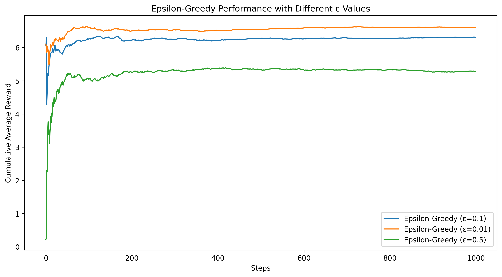

# Multi-Armed Bandit Algorithm Analysis

This report presents a comparative analysis of three multi-armed bandit algorithms: **Epsilon-Greedy, Upper Confidence Bound (UCB), and Thompson Sampling**. The study evaluates their performance based on exploration-exploitation trade-offs and cumulative rewards over 1000 steps.

## Epsilon-Greedy Algorithm

The **Epsilon-Greedy** algorithm selects the best-known arm with probability **(1 - ε)** and explores a random arm with probability **ε**. The experiment tests **ε = 0.1, 0.01, 0.5** to understand how exploration rates influence learning efficiency.

## Upper Confidence Bound (UCB) Algorithm

The **UCB algorithm** selects actions based on an upper confidence bound, balancing exploration and exploitation dynamically. The experiment evaluates **UCB with c = 1, 2, 5** to observe the effect of confidence values.

## Thompson Sampling Algorithm

**Thompson Sampling** uses a Bayesian approach to dynamically adjust exploration. The experiment evaluates its performance in a **Bernoulli bandit environment** over 1000 steps.

## Overall Comparison of Algorithms

The results indicate that each algorithm has its **strengths and weaknesses**:

- **Epsilon-Greedy** performs best when **ε = 0.1**, balancing exploration and exploitation.
- **UCB** achieves strong results with a **moderate confidence value (c = 2)**.
- **Thompson Sampling** is the most **adaptive and high-performing** algorithm.

The overall performance comparison of all three algorithms is shown below:

## Conclusion

- **Thompson Sampling** achieves the highest cumulative rewards, as it dynamically adjusts exploration without requiring fixed tuning.
- **UCB with moderate confidence (c = 2) performs well**, especially in structured environments.
- **Epsilon-Greedy is simple but requires fine-tuning of ε to be effective**.

This analysis provides insights into choosing the **best exploration-exploitation strategy** for different problem settings.
